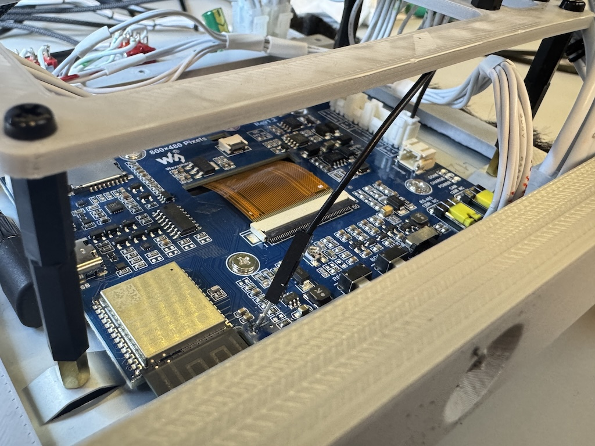
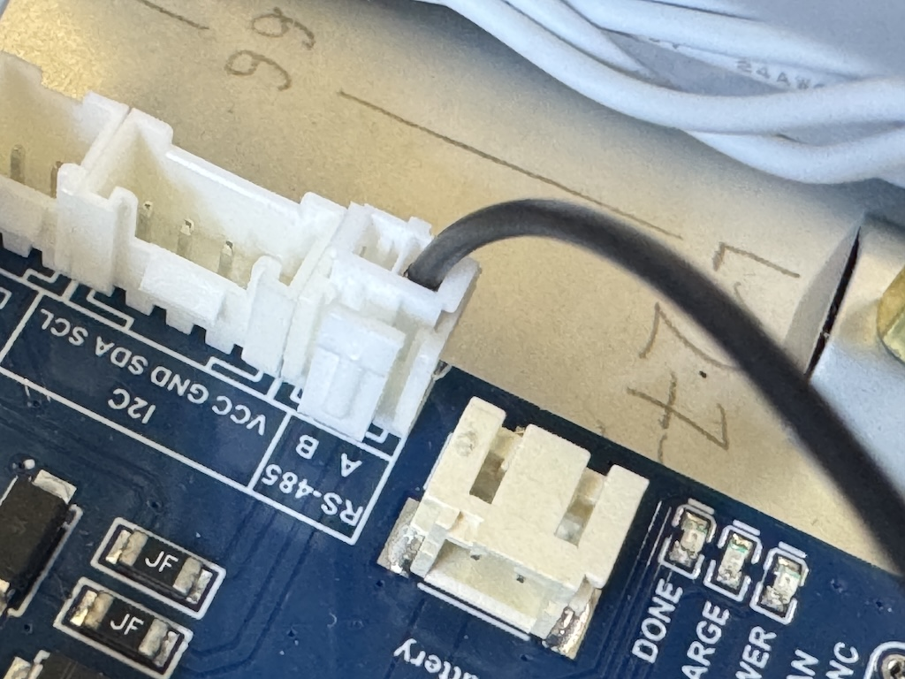

# IFEI

The Waveshare ESP32-S3-Touch-LCD-7 7" display doesn't provide built-in PWM backlight control. To fix this, connect the backlight to a PWM-capable GPIO by wiring the backlight test pad to the RS485 Data A pin (GPIO 16).

To do that, use the two-wire connector included with the display.

- Remove the red wire from the connector.
- Connect the connector to the RS485 socket.
- Solder the other end of the black wire to the backlight test pad.

See the images below for reference. (Credit: [Ulukaii](https://github.com/eHanseJoerg))

